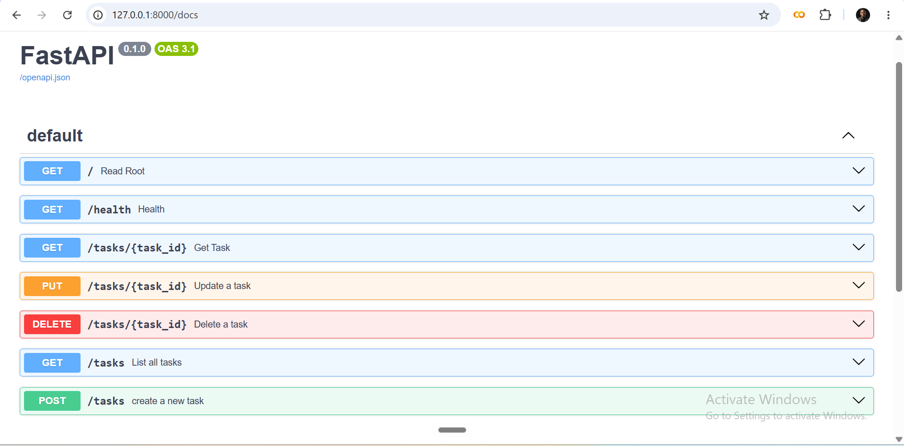

# Task API

[1-2 sentences: what this is, what it does]

## Run it

\`\`\`bash
git clone <your-repo-url>
cd todo-api
python3 -m venv venv
source venv/Scripts/activate   # Windows Git Bash
pip install -r requirements.txt
uvicorn app.main:app --reload
\`\`\`

Visit `http://localhost:8000/docs` for interactive API docs.

## Endpoints

| Method | Path             | Description         |
|--------|------------------|----------------------|
| GET    | /                | API info             |
| GET    | /health          | Health check         |
| GET    | /tasks           | List all tasks       |
| GET    | /tasks/{id}      | Get one task         |
| POST   | /tasks           | Create a task        |
| PUT    | /tasks/{id}      | Update a task        |
| DELETE | /tasks/{id}      | Delete a task        |

## Example

\`\`\`
$ curl -i -X PUT http://localhost:8000/tasks/1 -H "Content-Type: application/json" -d '{"title":"Buy oat milk","done":true}'
curl -i http://localhost:8000/tasks/1
curl -i -X DELETE http://localhost:8000/tasks/1
curl -i http://localhost:8000/tasks/1
HTTP/1.1 200 OK
date: Mon, 20 Jul 2026 10:54:14 GMT
server: uvicorn
content-length: 43
content-type: application/json

\`\`\`

## Swagger UI

